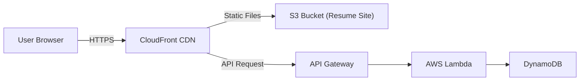

# Cloud Resume Challenge – AWS

## Overview

This project is a cloud-hosted personal resume that I built as part of the **Cloud Resume Challenge**.  
It demonstrates practical cloud engineering skills including infrastructure automation, serverless architecture, and CI/CD.

The site is fully automated from infrastructure provisioning to deployment using modern AWS services and Infrastructure as Code (terraform).

🔗 **Live site:** https://harry-sivasambu.com

---

## Architecture (High Level)

The solution uses a serverless architecture designed for scalability, reliability, and low operational overhead.

**Flow:**

1. Users access the site via **CloudFront**
2. Static content is served from **Amazon S3**
3. API requests are routed through **API Gateway**
4. **AWS Lambda** processes requests (visitor counter)
5. **DynamoDB** stores persistent data

All infrastructure is managed using **Terraform**.



---

## Technologies Used

### Cloud & Infrastructure

- AWS S3 (static site hosting)
- Amazon CloudFront (CDN)
- API Gateway (HTTP API)
- AWS Lambda (Python)
- DynamoDB
- Terraform (Infrastructure as Code)

### CI/CD

- GitHub Actions
- Automated frontend and backend deployments

---

## Infrastructure as Code (Terraform)

All AWS resources are managed using Terraform.

Key characteristics:

- Existing infrastructure imported and fully managed by Terraform
- Zero-drift configuration (`terraform plan` returns no changes)
- Multi-region setup (CloudFront, Lambda, API Gateway)
- Clean separation between infrastructure and application logic

This ensures reproducibility, consistency, and safe iteration.

---

## CI/CD Pipeline

### Frontend Deployment

Triggered on push to `main`:

- Static files synced to S3
- CloudFront cache invalidated automatically

### Backend Deployment

Triggered on backend changes:

- Python tests executed
- Lambda function packaged and deployed automatically

This allows code changes to reach production without manual steps.

---

## How It Works (Quick Overview)

1. User loads the site through CloudFront
2. Frontend calls an API endpoint
3. API Gateway routes the request to Lambda
4. Lambda updates a DynamoDB counter
5. The response is returned to the browser

---

## Running Locally

### Backend

```bash
cd backend
pip install -r requirements.txt
python app.py
```
